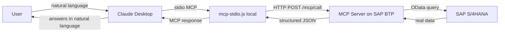

# SAP Maintenance Orders — Natural Language Queries with AI

> Imagine asking your AI assistant: *"I have a meeting right now about the EDDY Pumps — give me a quick summary of all open orders."* — and getting the answer straight from SAP, in seconds, without opening a single transaction.

**That's exactly what this project does.**


---

## See It in Action

Two real examples of Claude Desktop answering live SAP S/4HANA data — no screens, no filters, no technical SAP knowledge required.

### Example 1 — Summary before a meeting

https://github.com/bernardcaldas/mcp-maintenance-cap/raw/main/video-1-claude%20-%20meeting%20summary.mp4

> *"I have a meeting right now about the EDDY Pumps. Give me a quick summary of all open orders for them."*

The assistant queries SAP and delivers a structured summary — equipment, status, priority — ready to take into the meeting.

---

### Example 2 — Investigating a leak

https://github.com/user-attachments/assets/586be198-44f7-4c19-b143-fb5e7224ad95

> *"Is there any order related to an oil leak? What is planned to fix it?"*

The assistant finds the relevant orders and describes what is planned in the operations — without the user needing to know any SAP transaction code.

---

## The Problem It Solves

Maintenance managers, coordinators, and field technicians need SAP data every day. To get it today, they must:

- Have access to SAP GUI or Fiori
- Know the right transaction (IW38, IW39...)
- Know how to configure filters and navigate screens

**The result:** information locked behind a complex system, dependency on technical profiles for simple queries, time wasted.

With this project, anyone with access to the AI assistant can query that data in natural language — no training, no screens, no filters.

---

## More Questions That Already Work

```
"Which orders have priority 1 in plant 1010?"

"Equipment 10001949 — does it have more than one open order? Show me all of them."

"What is the detailed status of order 4000300?"

"I have a meeting now about the EDDY Pumps. Give me a quick summary of all open orders for them."

"Is there any order related to a leak? What is planned to fix it?"
```

---

## What Can Be Built With This Approach

This is a fully working proof of concept. The same architecture applies to any SAP module:

| Module | What the AI could answer |
|--------|--------------------------|
| **PM** — Plant Maintenance | Orders, equipment, failure history |
| **MM** — Materials Management | Stock, purchase orders, suppliers |
| **SD** — Sales & Distribution | Sales orders, deliveries, invoicing |
| **QM** — Quality Management | Inspections, quality notifications |
| **FI/CO** — Finance | Cost centers, postings, reports |

---


> Interested? Reach out: **bernardo.acaldas@gmail.com**

---

---

## Technical Reference

### How It Works



Two layers:
- **`mcp-stdio.js`** — runs locally, bridges Claude Desktop (MCP stdio protocol) to the BTP server
- **MCP Server on BTP** — hosted on SAP BTP Cloud Foundry, queries the SAP S/4HANA OData API

### Stack

| Layer | Technology |
|-------|-----------|
| Framework | SAP CAP (Cloud Application Programming) |
| Server | Node.js + Express |
| Protocol | MCP (Model Context Protocol) |
| SAP API | OData REST via SAP Business Accelerator Hub |
| Hosting | SAP BTP Cloud Foundry |
| AI Client | Claude Desktop (Anthropic) |

---

### Running Locally

```bash
git clone https://github.com/bernardcaldas/mcp-maintenance-cap.git
cd mcp-maintenance-cap
npm install
npm run dev
```

Test it:

```bash
curl -X POST http://localhost:4004/mcp/call \
  -H "Content-Type: application/json" \
  -d '{"tool": "get_maintenance_orders", "input": {"top": 3}}'
```

---

### Deploy on SAP BTP

```bash
cf login -a https://api.cf.us10-001.hana.ondemand.com
cf push mcp-maintenance-cap
cf set-env mcp-maintenance-cap SAP_API_KEY "your-key-here"
cf restart mcp-maintenance-cap
```

The API Key is available for free at [SAP Business Accelerator Hub](https://api.sap.com).

---

### Connect to Claude Desktop

Claude Desktop communicates via **MCP stdio** (JSON-RPC 2.0). The `mcp-stdio.js` file included in this repository is the local proxy that bridges Claude Desktop to the BTP server.

**Step 1 — make sure the app is running on BTP:**

```bash
cf start mcp-maintenance-cap
```

**Step 2 — configure Claude Desktop.**

Open `%APPDATA%\Claude\claude_desktop_config.json` and add:

```json
{
  "mcpServers": {
    "sap-maintenance": {
      "command": "node",
      "args": [
        "C:\\path\\to\\mcp-maintenance-cap\\mcp-stdio.js"
      ]
    }
  }
}
```

**Step 3 — restart Claude Desktop.** The tools icon (hammer) will appear confirming the MCP server was loaded.

---

<details>
<summary><strong>Lessons Learned</strong></summary>

### 1. Don't use a CDS service to expose MCP routes
CAP adds OData prefixes to routes and serializes responses in OData format — incompatible with the MCP protocol. The fix was to register Express routes directly via `cds.on('bootstrap', app => ...)`.

### 2. Add `express.json()` manually
CAP does not register this middleware for custom routes. Without it, `req.body` arrives as `undefined` even with `Content-Type: application/json` in the header.

### 3. Keep a valid .cds file
CAP requires at least one `.cds` file to initialize. Solution: a minimal `DummyService` as a placeholder.

### 4. API Key outside the repository
`manifest.yml` is committed with `SAP_API_KEY: ""`. The real key is set via `cf set-env` after deploy.

### 5. Claude Desktop does not support direct HTTP — requires a stdio proxy
Claude Desktop communicates with MCP servers exclusively via **stdio** (local process, JSON-RPC 2.0 over stdin/stdout). It is not possible to point directly to an HTTP URL in `claude_desktop_config.json`. The solution was to create `mcp-stdio.js`: a lightweight Node.js script that Claude Desktop spawns locally and that forwards each tool call to the `/mcp/call` endpoint on BTP.

### 6. MCP protocol requires specific methods
The Claude Desktop handshake expects three methods in sequence: `initialize` (version and capability negotiation), `tools/list` (schema for each tool), and `tools/call` (execution). `mcp-stdio.js` implements these three methods and translates them into HTTP calls to BTP.

</details>
